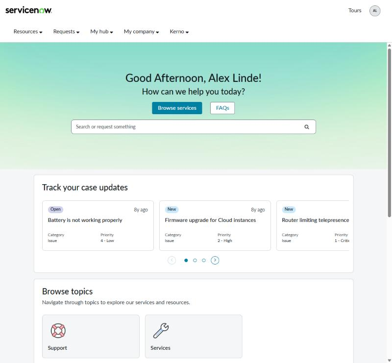
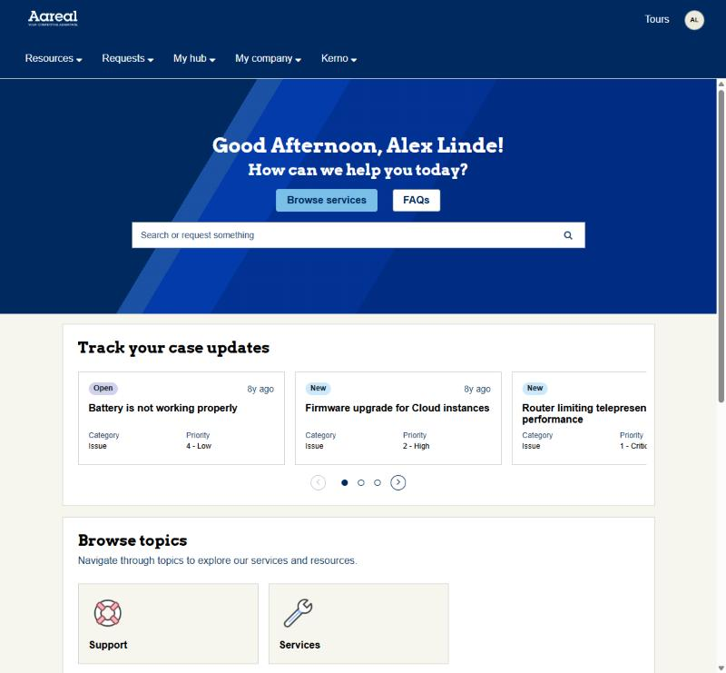
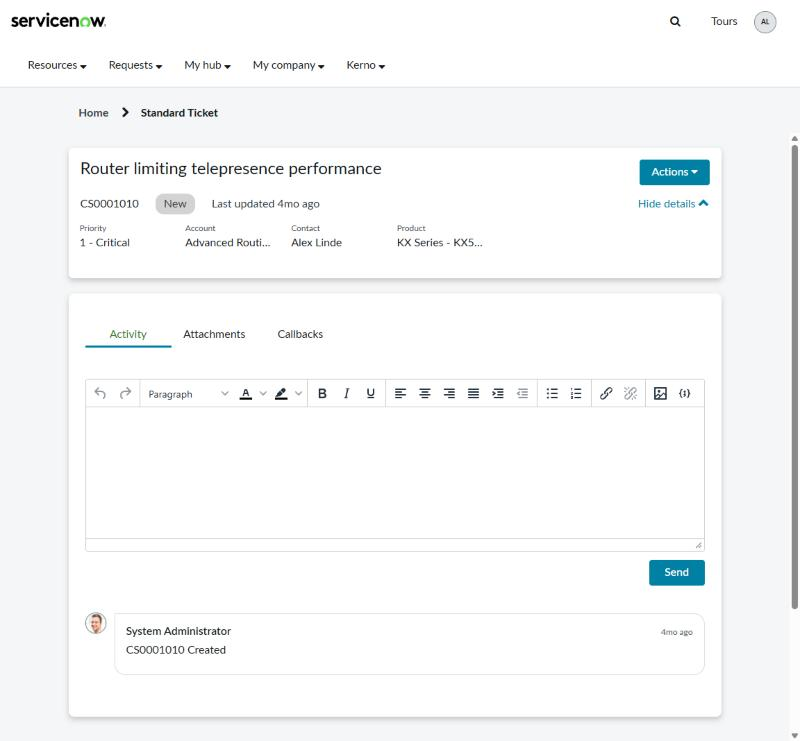
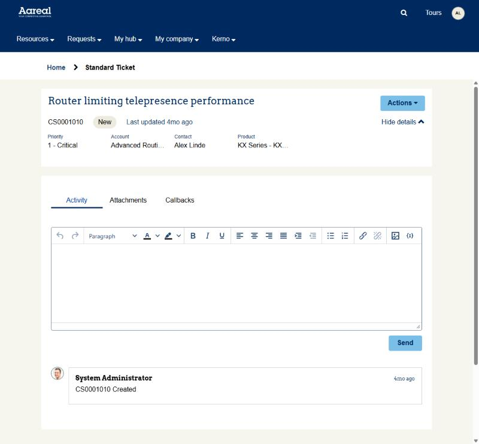
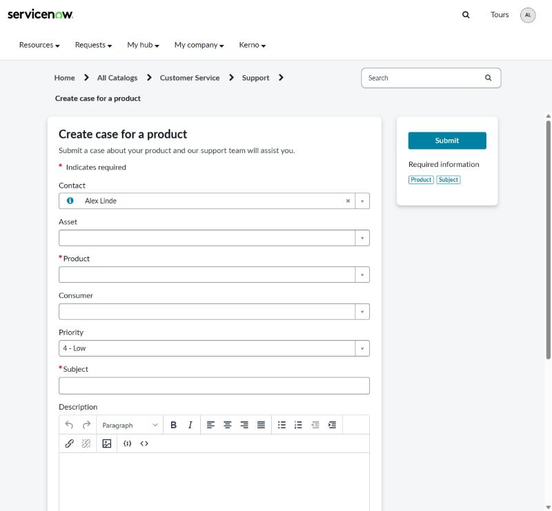
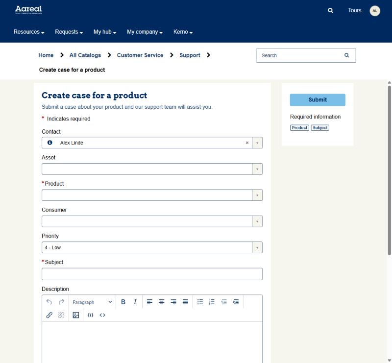
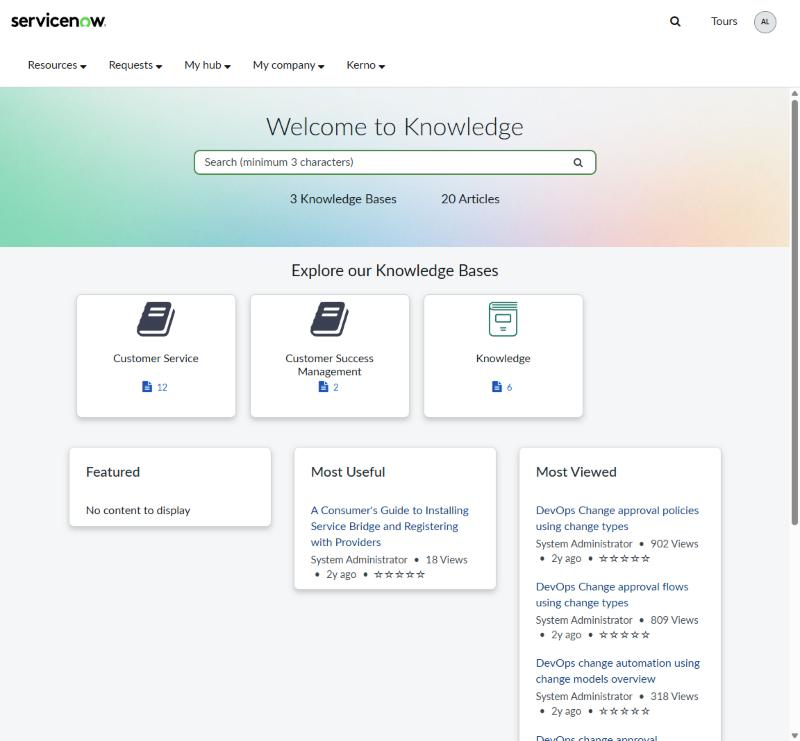
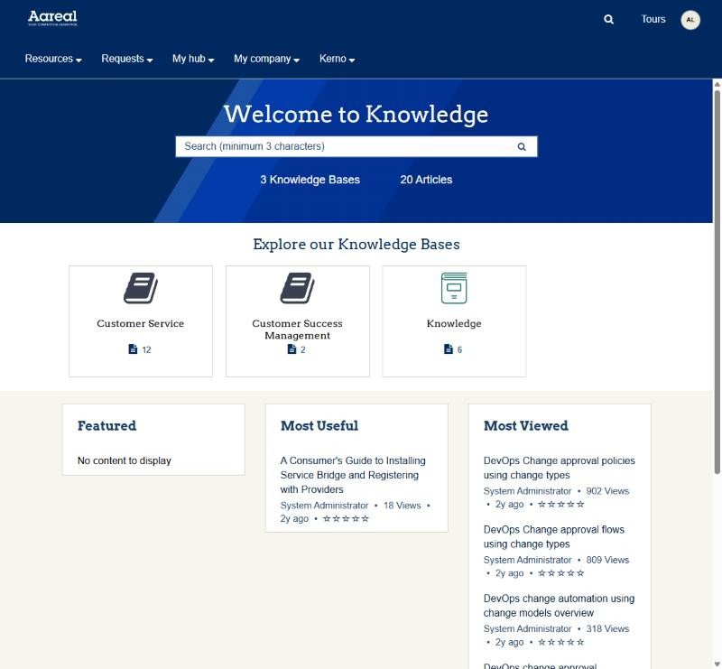

# Business Portal Brand Tokens

A theming framework for the ServiceNow **Business Portal** (Customer Experience Coral base). A client's full rebrand lives in one place: **Section 1 of the theme's CSS Variables**. Everything else (Bootstrap, the Coral stylesheets, the header and footer, OOTB widgets, Next Experience components) is wired to those values.

| | Stock Coral | Same portal, Aareal Bank example theme |
|---|---|---|
| Home |  |  |
| Case |  |  |
| Form |  |  |
| Knowledge |  |  |

Every colour, font, corner and the banner on the right come from Section 1 of the theme's CSS Variables; the logo and footer address are set on the portal record. See [the Aareal example](../examples/aareal/README.md).

Contents

1. [What's in the box](#1-whats-in-the-box)
2. [New client in six steps](#2-new-client-in-six-steps)
3. [How portal styling works](#3-how-portal-styling-works)
4. [The CSS Variables file](#4-the-css-variables-file)
5. [Choosing palette roles](#5-choosing-palette-roles)
6. [What each token changes](#6-what-each-token-changes) (full table: [token-reference.md](token-reference.md))
7. [Fonts](#7-fonts)
8. [Edge cases and limitations](#8-edge-cases-and-limitations)
9. [Troubleshooting](#9-troubleshooting)
10. [Maintenance and upgrades](#10-maintenance-and-upgrades)
11. [Deployment](#11-deployment)
12. [Records and files](#12-records-and-files)

Appendix: [variable-inventory.md](variable-inventory.md) - all 375 Coral variables and where each one now points.

---

## 1. What's in the box

| Piece | What it does |
|---|---|
| **CSS Variables template** (`theme/css_variables.template.scss`) | Replaces Coral's `css_variables`. Section 1 = client palette, Section 2 = documented brand tokens, Section 3 = every live Bootstrap/ServiceNow variable mapped to a token, Section 4 = dead legacy names kept for compatibility. |
| **`portal-brand-tokens-overrides`** (sp_css, one shared copy) | CSS include at order 1000 on every client theme. Feeds the tokens into the `--now-*` custom properties, lets the footer and banner differ from the header, and fixes ~240 hardcoded rules in OOTB stylesheets and widgets. Reads tokens only - never edited per client. |
| **`PortalBrandTokensUx`** (script include) | `sync()` generates a Next Experience (UX) theme from the palette, so macroponents (Product Catalog, AI Search, Now Assist) match. `cloneTheme()` copies a theme with its includes. |
| **UI actions on Portal Theme** | **Sync Next Experience theme** (button) and **Clone theme with includes** (related link). |
| **Business Portal Brand Template** (sp_theme) | Starting point for every client: template variables + the 15 Coral includes + the override include. Looks identical to stock Coral. |
| **Aareal Bank Theme (example)** (sp_theme) | Worked example of a strong client brand: dark header, light CTA, custom banner, embedded slab font, square flat cards. See [examples/aareal](../examples/aareal/README.md). |

How it was built: every stylesheet that reaches a Business Portal page was audited - Bootstrap core, the 15 Coral includes, the header and footer, every widget on ~55 pages (including nested rows and ticket-configuration widgets), and the static platform bundle. Each was compiled with a "canary" theme (every variable set to a unique sentinel value) to learn which variables are actually read, then checked in the browser with a deliberately loud palette to catch colours that don't come from the theme. With the template's Coral palette, the compiled core CSS matches stock Coral declaration for declaration (5,514 of 5,514). The only differences are intentional fixes and 1-step RGB rounding.

---

## 2. New client in six steps

1. **Copy the template.** Open *Service Portal > Themes > Business Portal Brand Template* and click the related link **Clone theme with includes**. Rename the copy to `<Client> Theme` and save. Rename *before* step 4, because the generated UX theme takes the theme's name.
2. **Fill in Section 1 of CSS Variables.** Only Section 1:
   - **1a** - paste the brand guide's colours under their own names (`$acme-navy: #1B2A4A;`).
   - **1b** - assign every palette role (see [section 5](#5-choosing-palette-roles)).
   - **1c** - if the guide specifies exact tints, pin them. Otherwise leave it, shades are generated.
   - **1d** - optional token overrides: CTA colour, heading colour, header colours, radii, font.

   Save. The portal recompiles on the next page load.
3. **Logo.** The Business Portal logo comes from the **portal** record (*Service Portal > Portals > Business Portal > Logo*), not the theme. On a dark header, use a light logo.
4. **Sync Next Experience.** On the theme, click **Sync Next Experience theme**. Repeat after every palette or font change. This step re-colours the Next Experience components.
5. **Attach.** Set *Portals > Business Portal > Theme* to the client theme.
   - If you created a **new portal record** instead of reusing `business_portal`, also create the system property `glide.service_portal.resize_text.<url_suffix>.base_font` = `16`. Without it every px value is converted to rem with a divisor of 10, so everything renders 60% too large.
6. **Verify.** Hard-refresh the portal. Check *System Log > All* for `com.vaadin.sass` errors (a compile error silently drops whole stylesheets). Walk the pages in the [verification list](#verification-pages).

Where things are set:

| Thing | Where |
|---|---|
| Colours, fonts, radii, spacing, header/footer/banner look | Theme > CSS Variables, Section 1 |
| Logo, portal title, homepage | Portal record |
| Next Experience component colours | Generated by the Sync button, never by hand |
| Menu items, quick links, banner text | Portal / widget instance options (content, not branding) |
| Case status pill colours | Instance option on the case cards widget (see [edge cases](#8-edge-cases-and-limitations)) |

---

## 3. How portal styling works

A Business Portal page loads CSS from seven places. The framework covers all of them:

| # | Layer | Compiled with the theme? | Covered by |
|---|---|---|---|
| 1 | **Core** `sp-bootstrap-rem.scss` - Bootstrap 3.4 + Service Portal core. Also turns ~150 SCSS variables into `--now-*` custom properties. | yes | Section 3 mapping |
| 2 | **Theme CSS includes** - the 15 Coral stylesheets (order 90-560) | yes | Section 3 + overrides C2 |
| 3 | **Header / footer widgets** | yes | Section 3 + overrides B, C3 |
| 4 | **Widget CSS** - each widget compiled separately, prefixed `.v<widget sys_id>`, injected *after* the theme CSS | yes (with the portal's theme) | Section 3 widget knobs + overrides C4-C14 (selectors start with `body` to win) |
| 5 | **`portal-brand-tokens-overrides`** - order 1000 | yes | itself |
| 6 | **UX theme block** `#sp_uxf_theme_variables` - `:root` custom properties from the linked Next Experience theme, loaded after the theme includes | no - from `sys_ux_theme` | overrides A (uses `html:root` to win) + the Sync button |
| 7 | **Static bundle** `css_includes_$sp.css` - select2, date picker, slider, skeleton loaders | **never** | overrides C11 |

```
Section 1  palette ($palette-*)  +  token overrides
   |
Section 2  brand tokens ($ui-*, all !default)  --->  portal-brand-tokens-overrides (A, B, C1-C14)
   |                                           --->  PortalBrandTokensUx.sync()  -->  generated UX theme
Section 3  Bootstrap / Coral / widget variables
   |
compiled core, includes, header/footer, every widget
```

**Why `!default` matters.** The theme's variables are prepended to every SCSS compile. Section 2 declares every token with `!default`, which means "only if nobody set it yet". So anything Section 1 sets wins, and every token derived from it (hover shades, header hover, footer, banner) recalculates. The consequence: **Section 1 can only reference `$palette-*`, your own 1a colours and literals**, because the `$ui-*` tokens don't exist yet at that point.

**Why a separate override sheet.** About 240 OOTB rules ignore the theme: literal colours in Coral includes and widgets, spacing variables used as radii, `!important` on button radii, the static bundle that is never compiled, inline placeholder colours, TinyMCE's own skin. Each fix is a small rule in `portal-brand-tokens-overrides` that reads tokens, so one shared copy serves every client. Each block names the widget or stylesheet it fixes, so it can be deleted when ServiceNow fixes the source.

**Why the Sync button.** Next Experience components (the Product Catalog macroponent, AI Search, Now Assist, `now-*` web components) don't read portal SCSS. They read ~5,000 component tokens from the Next Experience theme in *Matching Now Experience Theme*. ServiceNow resolves those tokens into literal values when it writes the page, so overriding the base `--now-color--*` scales in CSS isn't enough. `sync()` evaluates the theme's variables, rebuilds the ~40 base colour scales (brand, neutrals, alerts, focus, selection) and the font from the palette, writes `<theme> - Colors (generated)` and `<theme> - Typography (generated)`, and links `<theme> (generated UX theme)` to the portal theme.

---

## 4. The CSS Variables file

| Section | Who edits | Contents |
|---|---|---|
| **1. CLIENT** | you, per client | 1a brand guide colours - 1b palette roles (required) - 1c pinned shades (optional) - 1d token overrides (optional) |
| **2. BRAND TOKENS** | nobody (read it) | 2a generated shades - 2b colour roles - 2c header, footer, hero - 2d buttons - 2e typography - 2f shape & elevation - 2g spacing. All `!default`. |
| **3. PLATFORM MAPPING** | nobody | 378 Bootstrap / Coral / widget variables, each pointing at a token |
| **4. LEGACY** | nobody | 43 Coral variables nothing reads any more, mapped to tokens so custom widgets keep compiling |

**Syntax rules** (ServiceNow compiles with the Vaadin Sass compiler, which is stricter and older than dart-sass):

- One declaration per line, always ending in `;`. Put the `;` **before** any trailing `//` comment, never inside it. (Coral's own `$now-sp-nass-*` lines got this wrong, and the template fixes them.)
- No Sass maps (`map-get` is passed through literally and `@each $k, $v in $map` is a parse error). Colour functions (`mix`, `darken`, `lighten`, `rgba($colour, .5)`) work.
- In Section 1, reference only `$palette-*`, your 1a colours and literals.
- A parse error **silently drops the whole stylesheet**. Because these variables are prepended to every compile, a typo here unstyles the entire portal. After saving, reload the portal and check the System Log for `com.vaadin.sass`.
- An undefined variable is not an error. It is written into the CSS literally and the browser ignores that declaration, so the symptom is "that one thing stayed OOTB".

**Upgrading the framework** = replace everything from `SECTION 2` down with the new template's version and keep your Section 1.

---

## 5. Choosing palette roles

| Role | Drives | Rule of thumb |
|---|---|---|
| `$palette-primary` | Primary buttons (white text on it), Actions menus, toggles like "Hide details", pagination, progress, carousel dots, active tab underline, banner tint | ≥ 4.5:1 against white |
| `$palette-secondary` | Text links and text actions | ≥ 4.5:1 against white *and* `neutral-5` |
| `$palette-accent` | Selected/active state: active tab label, chosen items, active pills (white text on it) | ≥ 4.5:1 against white |
| `$palette-focus` | Focus ring | ≥ 3:1 against white |
| `$palette-neutral-5 … -100` | Light to dark: 5 = page background, 20 = borders/dividers, 60 = input borders, 85 = muted text, 90 = secondary text, 100 = body text | Must get darker step by step. 60 ≥ 3:1 on white; 85 ≥ 4.5:1 on `neutral-5` |
| `$palette-success/-warning/-danger/-info` | Icons, alert borders, required asterisks (danger), status buttons | Danger must read as "error" |
| `…-light` | Alert / label fills (text on them is `neutral-100`) | Pale |
| `$palette-rating(-dark)` | Stars | - |

Practical tips:

- **Small brand guide (2-3 colours)?** One colour can fill several roles. Aareal uses its navy for both primary and links, and borrows royal blues from its artwork for the selected state and focus.
- **CTA colour different from the brand colour?** Keep `$palette-primary` as the brand colour and set `$ui-button-primary-bg` in 1d, plus `$ui-button-primary-text` if the CTA is light. Aareal has sky-blue buttons with navy text on a navy brand.
- **No neutrals in the guide?** Grade the brand's background colour into its darkest colour so greys feel on-brand. Aareal goes from sand to navy: `$palette-neutral-60: mix($aareal-darkblue, $aareal-sand, 58%);`
- **Exact tints in the guide?** Pin them in 1c. Generated shades are `mix()` with black or white at fixed percentages (see 2a), which is good enough for most brands.
- **Coloured headings?** `$ui-heading-color: $palette-primary;` in 1d.
- **Dark header?** Set `$ui-header-bg` and `$ui-header-text` in 1d. Hover, active and disabled shades are derived from those two and work on dark too. The footer follows the header unless you set `$ui-footer-*`. You'll need a light logo.

---

## 6. What each token changes

The screenshots below are the lab portal with one group of tokens set to loud colours, so it's obvious what each token reaches. The exact override is in each caption. The full table of all 139 tokens (default, what it changes, what it's wired into) is in **[token-reference.md](token-reference.md)**.

### Brand colours (1b)


*`$palette-primary: #E6007E` - primary and secondary buttons, carousel dots, banner tint. Case status pills are **not** palette-driven (edge case).*


*Same override on a case: Actions, Send, "Hide details", active tab underline.*


*`$palette-accent: #E6007E` - the active tab label (selected state).*


*`$palette-secondary: #7A00FF` - links on a KB article ("Most Useful" titles, Copy Permalink, Post a comment).*


*`$palette-focus: #E6007E` - ring on the focused Subject field. `$palette-danger: #7A00FF` - required-field asterisks.*

### Text, surfaces, borders (2b)


*`$ui-text: #7A00FF` body text, header nav and field values; `$ui-text-secondary: #0057FF` "Last updated"; `$ui-text-muted: #E6007E` labels, timestamps, editor icons; `$ui-heading-color: #00A86B` title.*


*`$ui-page-bg` / `$ui-surface-subtle: #FBE3EF` page background; `$ui-border-subtle: #E6007E` header line and editor chrome; `$ui-border-strong: #7A00FF` input and search borders.*

### Header, footer, banner (2c)


*`$ui-header-bg: #2B1F5C; $ui-header-text: #FFFFFF; $ui-hero-bg: linear-gradient(120deg, #2B1F5C 0%, #E6007E 100%); $ui-hero-text: #FFFFFF`. Note the dark logo on the dark header: the logo is an image and needs a light variant.*


*`$ui-footer-bg: #E6007E; $ui-footer-text: #FFFFFF` - footer independent of the header (OOTB the footer always copies the header).*

`$ui-hero-bg` accepts any CSS background (colour, gradient, `url(...)`). The default is a soft gradient from the palette. Set `$ui-hero-bg: null;` and `$ui-hero-text: null;` to hand control back to the Portal Banner widget's own Background Image and colour options.

### Typography (2e)


*`$ui-font-family: Georgia, "Times New Roman", serif; $ui-font-weight-heading: 700; $ui-heading-color: #E6007E`.*

### Shape and elevation (2f)


*All radii `0`, `$ui-radius-button: 999px` (pill buttons), `$ui-shadow-card: 0 10px 28px 0 rgba(43, 31, 92, 0.35)`.*


*Same overrides on a case: square cards and editor, pill buttons, deeper shadow.*

### Spacing (2g)

`$ui-space-3xs … -3xl` (1-40px) feed ServiceNow's `$sp-space--*` scale and Bootstrap's padding variables (buttons, inputs, tables, panels, modals, alerts). `$ui-page-padding` is the gap around page content and `$ui-grid-gutter` the space between columns. Spacing is wired but deliberately not touched by the override sheet, which never changes layout. Treat these as density controls and change them sparingly.

---

## 7. Fonts

`$ui-font-family` sets the font everywhere: body, Bootstrap, headings (via `$ui-font-family-heading`), the Coral includes (one hardcodes "Lato", fixed in C2), `--now-font-family`, and, after **Sync**, the Next Experience Typography style.

The font also has to be **loaded**. Stock Coral embeds Lato as base64 WOFF2 in the sp_css `portal-next-experience-lato-fonts` (CSS include order 100, ~736 KB). For a client font:

1. Create an sp_css with `@font-face` rules for the weights you use (400, 600/700). `python tools/embed_font.py "Family" 400=regular.woff2 700=bold.woff2` writes them with the WOFF2 embedded as base64, like the Lato sheet (self-contained, no extra requests, works behind any CSP).
2. Add it as a CSS include on the client theme with a low order (e.g. 95).
3. Set `$ui-font-family: "Client Sans", Arial, sans-serif;` in 1d and click **Sync Next Experience theme**.
4. Remove the Lato include from the client theme if nothing uses Lato any more.

The Aareal example does exactly this: the open-source slab Arvo (SIL OFL) stands in for Aareal's commercial ITC Lubalin Graph, embedded in the `aareal-fonts` include at order 95, with `$ui-font-family-heading: "Arvo", Rockwell, Georgia, serif;`. Never embed a commercial font without a web licence, and check the client's privacy and CSP requirements before hot-linking a font CDN instead.

---

## 8. Edge cases and limitations

Things the theme cannot (cleanly) control, and what to do about them:

| Area | What happens | Why | What to do |
|---|---|---|---|
| **Case status pills** (home "Track your case updates" cards) | Fixed pastel colours (New `#CBE9FC`, Open `#D1D2EE`, Awaiting `#FBF7BF`, Resolved `#D2EABC`, Closed `#C2C4CA`, text `#181A1F`) | Set in the `portal_case_cards` widget's instance option `state_highlight_colour` (JSON) and applied inline by JS | Edit the instance option JSON per client if the pastels clash |
| **Logos and images** | Header/footer logo, taxonomy topic icons, empty-state illustrations, the default banner image | Images, not CSS | Supply a light logo for dark headers. Topic icons are content (taxonomy records). |
| **Portal Banner widget options** | The widget has its own text colours and background image | Instance options written inline | Overridden by `$ui-hero-text` / `$ui-hero-bg` by default. Set both to `null` to let the widget options win. |
| **KB article bodies** | Authored inline styles (coloured spans, tables) | Content, not theme | Clean up in the articles |
| **TinyMCE editable area** | The typing area of rich-text fields stays white with TinyMCE's own text colour | It's an iframe with TinyMCE's content CSS | Toolbar and frame are themed (C13). The content area is fine on light themes. |
| **select2 arrows** | Arrow comes from `select2.png` | Sprite image in the static bundle | Neutral grey, acceptable on light themes |
| **File-type icons, presence dots, Otto / Now Assist onboarding, guided tours** | Fixed colours | Platform components with hardcoded palettes | Leave as is |
| **Dark mode** | Not supported | Coral's dark variant is empty and the portal has no dark-mode switch | - |
| **Footer logo, address, copyright, links** | Not the header logo and not the theme | Portal record field `quick_start_config` (JSON `footer`: `logo_img_name`, `org_info`, `copyright`, menu ids) | Set per portal. An uploaded logo works as `/<attachment sys_id>.iix` |
| **Footer social icons** | Colour set in the footer configuration (`social_icons_color`) | Widget option | Set per client in the footer config |
| **Form panel heading** (instance `9dbfcec3…`) | `.panel-heading { background: $primary; color: #ffffff }` | Instance CSS | Follows primary. White text assumes a dark primary. |
| **Dead OOTB rules** | Rules using undefined variables (`$panel-border-color`, `$brand-primary-dark`, `$tropical-rain`, `$gull-grey`, `$mesp-*`, `$selection-primary*`, `$default`, `$border-width-xs`, `$navbar-invese-bg` typo) never apply | OOTB bugs | Left dead on purpose. Defining them would *change* the stock look. |
| **OOTB SCSS bugs** | `portal-banner` widget: `$sp-space--xxs: 2px; !default;` (semicolon before `!default` forces 2px). Coral's `$navbar-inverse-*` declared twice (the second block is dead). Some `--now-*` props get a literal variable name. | Platform bugs | Harmless with the framework. Noted so nobody chases them. |
| **Next Experience components** | Use the old colours until synced | They read the UX theme, not SCSS | Click **Sync Next Experience theme** after every palette/font change |
| **Next Experience shapes** | Radii and shadows inside components such as the Product Catalog stay Coral (rounded panels on a square theme) | Sync generates colours and fonts only; "Shape and Form" is shared with the base UX theme | Accept, or extend `PortalBrandTokensUx` to generate the shape style too |

---

## 9. Troubleshooting

| Symptom | Cause | Fix |
|---|---|---|
| Portal (or a big part of it) is unstyled | SCSS parse error in CSS Variables. The whole stylesheet is dropped. | System Log, filter on `com.vaadin.sass`. Usual culprits: missing `;`, `;` inside a `//` comment, map syntax, unbalanced brackets. |
| One thing stayed OOTB | Undefined variable written literally, or a Section 1 line referencing a `$ui-*` token | Check spelling. In Section 1 use only `$palette-*`, 1a colours and literals. |
| Saved, but no change | Theme CSS cache | Save the **theme** record (or click Sync, which force-updates it), then hard-refresh. Editing only an sp_css doesn't flush the theme cache. |
| Everything ~60% too big on a new portal | No `base_font` property for the portal's URL suffix (default divisor is 10) | Create `glide.service_portal.resize_text.<url_suffix>.base_font` = `16` |
| Product Catalog / AI Search / Now Assist in old colours | Generated UX theme is stale or missing | Click **Sync Next Experience theme** |
| Old "(generated UX theme)" records lying around | The theme was renamed after a sync | Delete the old generated theme and styles. Sync again. |
| A widget ignores a colour | It's hardcoded, or in a widget not seen during the audit (new release, custom widget) | Add a rule to the right C-section of the override sheet (see [10](#10-maintenance-and-upgrades)) |

<a id="verification-pages"></a>**Verification pages** (Business Portal page ids): `portal_b2b_home`, `csm_login`, `csm_registration`, `kb_home`, `kb_search`, `kb_article_view`, `sc_home`, `portal_taxonomy`, `product_catalog`, `csm_get_help`, `portal_cases`, `standard_ticket` (a case), `portal_approvals`, `portal_contacts`, `portal_install_base_items`, `csm_profile`, `sp_search`, `portal_faqs`, `sc_cart`, a 404. Check: buttons, links, active tab, focus ring (Tab key), required asterisks, alert colours, header/footer, banner, an open select2 dropdown, the date picker, the rich-text editor.

---

## 10. Maintenance and upgrades

**Framework upgrade.** Replace Sections 2-4 of each client theme with the new template's, keeping Section 1. Replace the shared `portal-brand-tokens-overrides` and `PortalBrandTokensUx`. Re-run Sync on each theme.

**After a ServiceNow upgrade** (or when adding widgets), re-run the two audits on a lab portal:

1. **Regression diff.** Compile core with stock Coral and with the template and compare declaration by declaration. The compile endpoint takes any theme:
   `/styles/scss/sp-bootstrap-rem.scss?portal_id=<portal>&theme_id=<theme>&uxf_theme_id=<ux theme>`
   Expected: same declaration count, only the known intentional differences.
2. **Loud-palette sweep.** Put an obviously fake palette in the lab theme's Section 1 (sepia-tinted neutrals plus magenta, purple and green brand colours), click Sync, walk the verification pages and look for anything still Coral teal, blue or grey. That's a hardcoded colour. Find its source (widget CSS, include or static bundle) and add a fix.

**Adding a fix** to `portal-brand-tokens-overrides`: put it in the matching C-section, start the selector with `body` (widget CSS loads later), use tokens only, never change layout, and add a comment naming the widget/stylesheet it fixes.

**Adding a token**: declare it in Section 2 with `!default` and a comment, map platform variables to it in Section 3, add its description to `tools/docs/token-content.json`, and add it to `PortalBrandTokensUx.buildBaseColours()` if Next Experience components should follow it.

**Regenerating the docs** after any change to the theme files: `python tools/docs/build_docs.py` rewrites `token-reference.md`, `variable-inventory.md` and `brand-tokens.html` (it warns about tokens without a description). Then republish `brand-tokens.html` to the team page.

---

## 11. Deployment

Framework (once per instance, in its own update set):

- sp_css `portal-brand-tokens-overrides` + its sp_css_include
- script include `PortalBrandTokensUx`
- UI actions *Sync Next Experience theme* and *Clone theme with includes* (table `sp_theme`)
- sp_theme *Business Portal Brand Template* + its 15 `m2m_sp_theme_css_include` records

Per client:

- the client sp_theme + its include records (created by the clone)
- the portal's theme field (and logo)
- `glide.service_portal.resize_text.<suffix>.base_font` if it's a new portal record
- the generated UX theme: either move the generated `sys_ux_theme` / `sys_ux_style` / `m2m_theme_style` records, or (simpler) click **Sync Next Experience theme** once in the target instance after the update set is committed

The Aareal example has its own update set, *Portal Brand Tokens - Aareal Bank example* (theme, its includes, `aareal-fonts`, generated UX theme). It depends on the Framework set. The lab portal's logo and footer settings stay in the scratch set.

The generated UX records are tracked by update sets (type *UX Theme*, *UX Style*, *UX Theme Style*). Use the UI actions in your own session so changes land in your current update set. Scripts that run as `system` (scheduled jobs, triggers) write to *Default*; move those `sys_update_xml` records afterwards.

---

## 12. Records and files

Local source of truth (`portal-branding-framework/`):

| File | Instance record |
|---|---|
| `theme/css_variables.template.scss` | sp_theme *Business Portal Brand Template* `6f3055f42b77cf10a5feffb86e91bf67` (css_variables) |
| `examples/aareal/css_variables.aareal.scss` | sp_theme *Aareal Bank Theme (example)* `a32169b42b7bcf10a5feffb86e91bf12` |
| `examples/aareal/aareal-fonts.scss` | sp_css `1b5161302b374350ff68f76a6e91bf01`, include `5f5161302b374350ff68f76a6e91bf02` (order 95 on the Aareal theme) |
| `examples/noris/css_variables.noris.scss` | sp_theme *noris Theme* `d71405382beacf54a5feffb86e91bf75` (test theme) |
| `tools/embed_font.py` | builds `@font-face` stylesheets with embedded WOFF2 |
| `theme/portal-brand-tokens-overrides.scss` | sp_css `39fcc9782b37cf10a5feffb86e91bf83`, include `010dc9782b37cf10a5feffb86e91bfa4` |
| `theme/PortalBrandTokensUx.js` | sys_script_include `b61595742b734350ff68f76a6e91bf7a` |
| `theme/ui-actions.js` | sys_ui_action `462559742b734350ff68f76a6e91bf60` (Sync), `f23ad9f82bf7cf10a5feffb86e91bfb4` (Clone) |
| `docs/` | this guide (hand-written), token reference, variable inventory, `brand-tokens.html` (the team page), screenshots |
| `tools/docs/` | `build_docs.py` regenerates the token reference, inventory and `brand-tokens.html` from the theme files; `token-content.json` holds the hand-written token descriptions and screenshot captions |
| `audit/` | audit notes, scanner/crawler scripts, per-variable usage table |

Reference IDs: Business Portal `f264dbaccbfd52108d3f6a6fc041e4b5`; stock Coral theme `60bed96c93131210aa38860754891827`; base Coral UX theme `fad87d2ca304121029a4d1aed31e610f`; Aareal generated UX theme `c761e1302b374350ff68f76a6e91bfe4`; lab portal `/theme_lab` `5db5c93c2b7f0350ff68f76a6e91bff6` (currently showing the Aareal example).
