# Token reference

Every token in Sections 1 and 2 of `css_variables`, what it visibly changes, and where it is wired in.

* **Default** - the framework default (Coral look). Section 1 values are the template's Coral palette.
* **Wired into** - platform variables mapped to it in Section 3/4, other tokens derived from it, and the sections of `portal-brand-tokens-overrides` that use it (A = Next Experience bridge, B = footer, hero, menu bar & headings, C1-C14 = hardcoded fixes, see the guide).
* Override any Section 2 token in Section 1d. Derived tokens recalculate automatically.

## 1b. Palette roles (required)

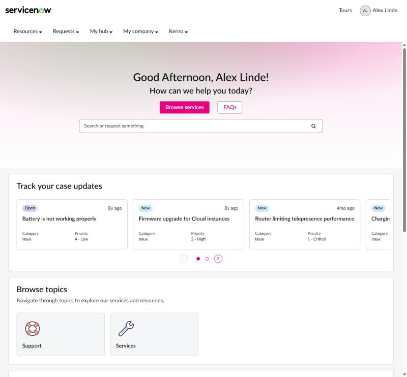
*`$palette-primary: #E6007E` - primary/secondary buttons, carousel dots, banner tint*

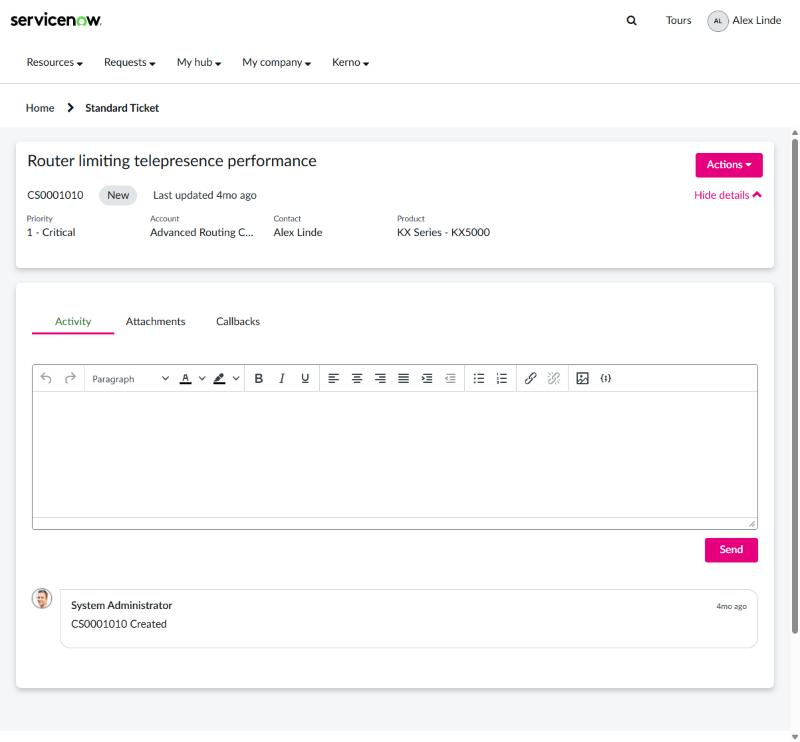
*`$palette-primary: #E6007E` on a case - Actions, Send, Hide details, active tab underline*

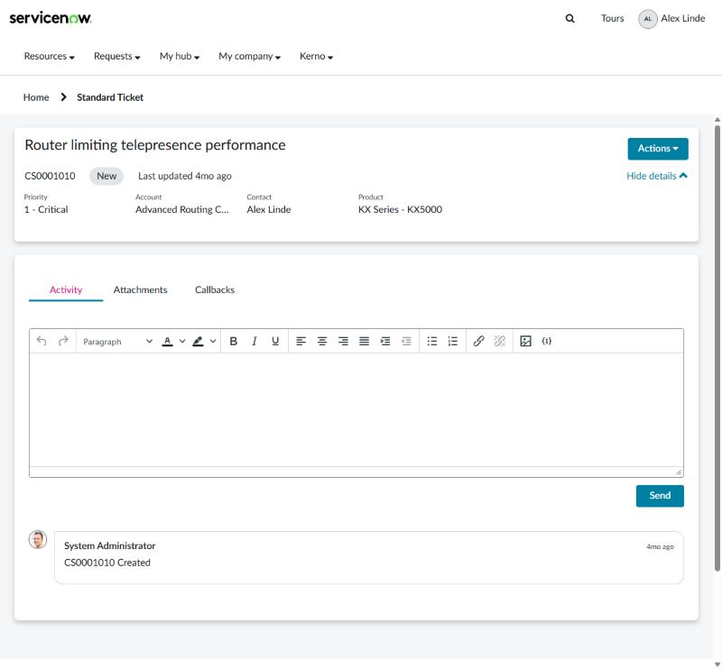
*`$palette-accent: #E6007E` - the active tab label (selected state)*

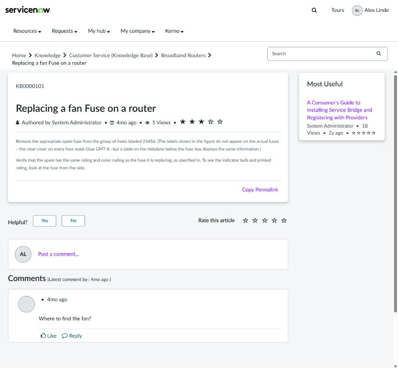
*`$palette-secondary: #7A00FF` - links on a KB article*

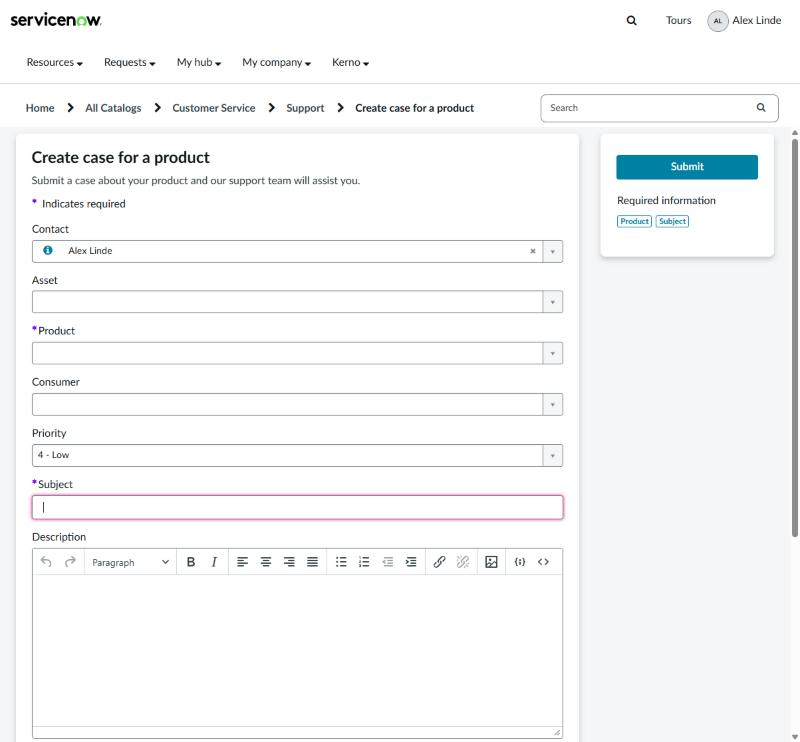
*`$palette-focus: #E6007E` (ring on Subject) and `$palette-danger: #7A00FF` (required asterisks)*

| Token | Default | What it changes | Wired into |
|---|---|---|---|
| `$palette-primary` | `#0080A3` | Main brand colour. Becomes `$ui-primary` (primary buttons, "Actions" menus, "Hide details" toggles, pagination, progress bars, carousel dots, active tab underline, brand fills), seeds the generated primary shades (2a) and tints the default home banner gradient. | feeds `$palette-primary-dark`, `$palette-primary-darkest`, `$palette-primary-light`, `$palette-primary-lightest` +3 |
| `$palette-secondary` | `#1955BE` | Links and text actions (`$ui-link`): text links such as KB article titles, "Copy Permalink" and "Post a comment", faceted search, condition-builder AND groups. Seeds the link hover shade. | feeds `$palette-secondary-dark`, `$ui-link` |
| `$palette-accent` | `#2D7524` | Selected / active state (`$ui-selected`): active tab label, active pills, chosen dropdown and list items, toggles, select2 highlight. Second glow in the default banner gradient. | feeds `$palette-accent-dark`, `$palette-accent-light`, `$palette-accent-lightest`, `$ui-selected` +1 |
| `$palette-focus` | `#359325` | Keyboard focus ring on inputs, buttons, links and Next Experience components (`$ui-focus`). Needs at least 3:1 contrast with white. | feeds `$ui-focus` |
| `$palette-white` | `#FFFFFF` | Card, panel, input, menu and modal surfaces; text and icons on coloured fills; default header background. | `$fav-star-color-off`, `$color-lightest`; feeds `$ui-on-primary`, `$ui-on-selected`, `$ui-text-inverse`, `$ui-surface` +2; overrides A |
| `$palette-neutral-5` | `#F5F6F7` | Page background and subtle fills: table stripes, hover rows, panel headers, disabled inputs. | `$gray-lighter`; feeds `$ui-page-bg`, `$ui-surface-subtle`; overrides A |
| `$palette-neutral-10` | `#E2E5E7` | Stronger fills: progress track, code background, active/hover table rows, skeleton loaders. | `$color-lighter`; feeds `$ui-surface-strong`; overrides A |
| `$palette-neutral-20` | `#CFD5D7` | Dividers and the borders of cards, panels, tables, dropdowns and modals (`$ui-border-subtle`). Default label background. | `$label-default-bg`; feeds `$ui-border-subtle`; overrides A |
| `$palette-neutral-30` | `#BCC3C7` | Light grey (`$color-light`) and the matching Next Experience neutral step. | `$color-light`; overrides A |
| `$palette-neutral-40` | `#AAB2B6` | Secondary borders (`$ui-border`): pagination hover, like/reply buttons, tab hover underline. Empty KB rating stars. | `$kb-attachment-star-empty`; feeds `$ui-border`; overrides A, C5 |
| `$palette-neutral-50` | `#97A2A6` | Disabled controls and icons (Next Experience disabled states, KB attachment controls). | `$color-disabled`; overrides A, C5 |
| `$palette-neutral-60` | `#737F84` | Form input borders and the secondary button border (`$ui-border-strong`). Needs at least 3:1 contrast with white. | feeds `$ui-border-strong`; overrides A |
| `$palette-neutral-70` | `#616D74` | Badge background, Bootstrap `$gray-light`, secondary button hover border. | `$gray-light`, `$badge-bg`; feeds `$ui-button-secondary-hover-border`; overrides A |
| `$palette-neutral-80` | `#4F5C62` | Mid-dark grey for Next Experience components and AI Search tertiary text. | `$now-sp-nass-color-text-tertiary`, `$now-sp-nass-color-neutral-10`, `$color-dark`; overrides A |
| `$palette-neutral-85` | `#37444A` | Muted text (`$ui-text-muted`): hints, placeholders, field labels, timestamps, breadcrumbs, editor toolbar icons. | `$gray`, `$color-darker`; feeds `$ui-text-muted`, `$ui-button-secondary-active-border`; overrides A |
| `$palette-neutral-90` | `#232E33` | Secondary text (`$ui-text-secondary`): supporting text, legends, 'last updated' meta lines. | `$now-sp-nass-color-background-secondary-actionable`; feeds `$ui-text-secondary`; overrides A |
| `$palette-neutral-95` | `#1D272B` | Dark fills: `<kbd>`, preformatted text, Bootstrap `$gray-dark`. | `$gray-dark`, `$kbd-bg`, `$pre-color`; overrides A |
| `$palette-neutral-100` | `#10171A` | Body text (`$ui-text`) and the text on status fills (`$ui-status-text`). | `$gray-darker`, `$color-darkest`; feeds `$ui-text`, `$ui-status-text`; overrides A |
| `$palette-black` | `#000000` | Modal backdrop and Bootstrap `$gray-base`; replaces the literal blacks in core CSS. | `$gray-base`, `$modal-backdrop-bg`; overrides A, C1b |
| `$palette-success` | `#3E8600` | Success status: icons, alert borders, `.btn-success`, timeline success badge. | feeds `$palette-success-dark`, `$ui-success` |
| `$palette-success-light` | `#C7DCB5` | Success alert, label and banner fill. | feeds `$ui-success-bg` |
| `$palette-warning` | `#B29800` | Warning status: icons, alert borders, 'due today'. | feeds `$palette-warning-dark`, `$palette-warning-mid`, `$ui-warning` |
| `$palette-warning-light` | `#ECE5BF` | Warning alert/label fill, journal 'note' comments, search-term highlight. | feeds `$ui-warning-bg` |
| `$palette-danger` | `#E52239` | Danger status: required-field asterisks, error text and borders, `.btn-danger`, overdue dates. | feeds `$palette-danger-dark`, `$ui-danger` |
| `$palette-danger-light` | `#F9C8CE` | Danger alert and label fill. | feeds `$ui-danger-bg` |
| `$palette-info` | `#007AC9` | Info status: icons, alert borders, info messages. | `$form-label-bg-color`; feeds `$palette-info-dark`, `$palette-info-mid`, `$ui-info` |
| `$palette-info-light` | `#BDDCF1` | Info alert and label fill. | feeds `$ui-info-bg` |
| `$palette-rating` | `#D1A940` | Filled rating and favourite stars. | feeds `$ui-rating-star` |
| `$palette-rating-dark` | `#C28C00` | Star outline. | feeds `$ui-rating-star-outline` |

## 2a. Generated shades (skipped for any shade pinned in 1c)

| Token | Default | What it changes | Wired into |
|---|---|---|---|
| `$palette-primary-dark` | `mix(#000000, $palette-primary, 33%)` | Hover / pressed state of everything primary (`$ui-primary-hover`). | `$now-sp-nass-color-primary-2`; feeds `$ui-primary-hover`; overrides A |
| `$palette-primary-darkest` | `mix(#000000, $palette-primary, 65%)` | Deepest brand shade (Bootstrap `$brand-primary-darkest`, Next Experience brand colour). | `$brand-primary-darkest`; overrides A |
| `$palette-primary-light` | `mix(#FFFFFF, $palette-primary, 37%)` | Light brand tint (`$brand-primary-lighter`, Next Experience interactive tint). | `$brand-primary-lighter`; overrides A |
| `$palette-primary-lightest` | `mix(#FFFFFF, $palette-primary, 74%)` | Light brand fill (`$ui-primary-subtle`): menu hover, chips, select2 hover, editor button hover. | `$now-sp-nass-color-primary-0`; feeds `$ui-primary-subtle`; overrides A |
| `$palette-primary-pale` | `mix(#FFFFFF, $palette-primary, 90%)` | Faintest brand tint: primary label background, search result highlights, bottom of the default banner gradient. | `$label-primary-bg`, `$table-hover`; feeds `$ui-hero-bg`; overrides C4 |
| `$palette-secondary-dark` | `mix(#000000, $palette-secondary, 32%)` | Link hover colour (`$ui-link-hover`). | feeds `$ui-link-hover` |
| `$palette-accent-dark` | `mix(#000000, $palette-accent, 25%)` | Pressed / strong selected state (`$ui-selected-strong`). | feeds `$ui-selected-strong` |
| `$palette-accent-light` | `mix(#FFFFFF, $palette-accent, 42%)` | Light selection tint (Next Experience selection scale). | `$color-accent-light`; overrides A |
| `$palette-accent-lightest` | `mix(#FFFFFF, $palette-accent, 85%)` | Selected row background in data tables (`$ui-selected-subtle`). | feeds `$ui-selected-subtle` |
| `$palette-success-dark` | `mix(#000000, $palette-success, 22%)` | Dark success shade (alert text/icon contrast in Next Experience). | `$brand-success-darker`; overrides A |
| `$palette-warning-dark` | `mix(#000000, $palette-warning, 22%)` | Dark warning shade. | `$brand-warning-darker`; overrides A |
| `$palette-danger-dark` | `mix(#000000, $palette-danger, 22%)` | Dark danger shade; inline `<code>` text. | `$code-color`, `$brand-danger-darker`; overrides A |
| `$palette-info-dark` | `mix(#000000, $palette-info, 22%)` | Dark info shade. | `$brand-info-darker`; overrides A |
| `$palette-warning-mid` | `mix(#FFFFFF, $palette-warning, 50%)` | `.btn-warning` background. | `$btn-warning-bg`, `$btn-warning-border`; overrides A |
| `$palette-info-mid` | `mix(#FFFFFF, $palette-info, 49%)` | `.btn-info` background. | `$btn-info-bg`, `$btn-info-border`; overrides A |

## 2b. Colour roles

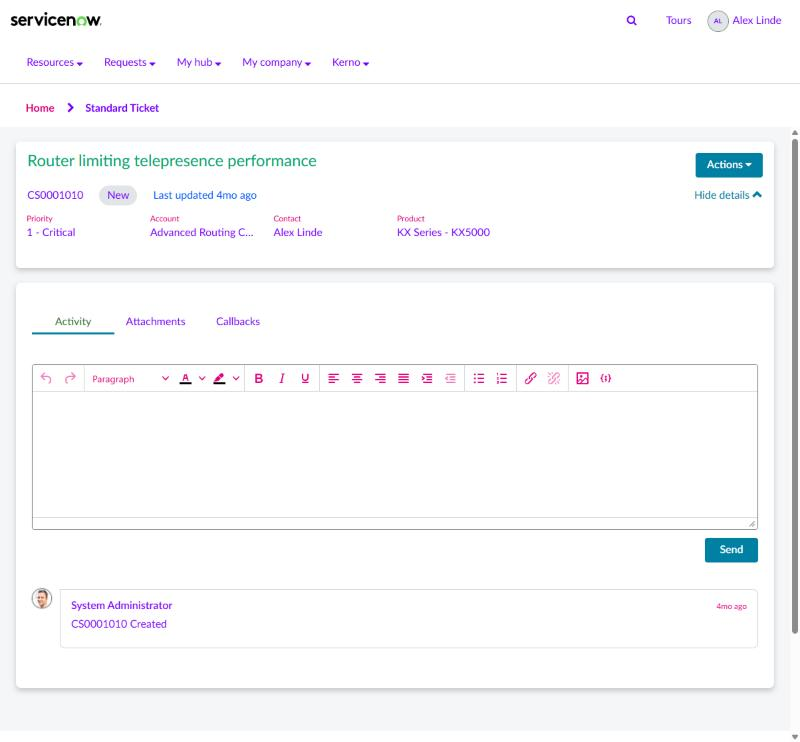
*`$ui-text: #7A00FF; $ui-text-secondary: #0057FF; $ui-text-muted: #E6007E; $ui-heading-color: #00A86B`*

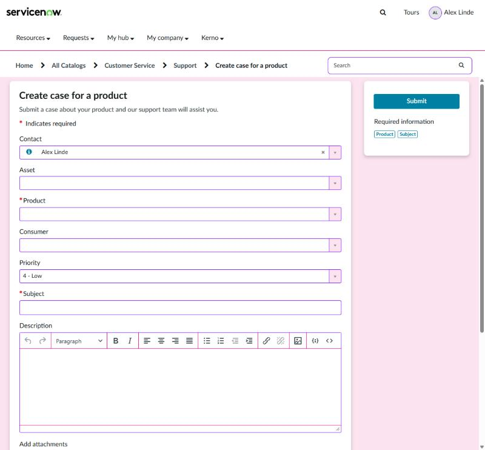
*`$ui-page-bg` and `$ui-surface-subtle: #FBE3EF`, `$ui-border-subtle: #E6007E`, `$ui-border-strong: #7A00FF`*

| Token | Default | What it changes | Wired into |
|---|---|---|---|
| `$ui-primary` | `$palette-primary` | Primary brand role: Bootstrap `$brand-primary`, primary buttons (via `$ui-button-primary-bg`), pagination, progress bars, carousel indicators, tab underline, catalog/list accents, Next Experience primary scale. | `$brand-primary`, `$primary`, `$sp-agent-chat-bg`, `$sc-reqd-focus-outline`, `$pagination-active-bg` +7 more; feeds `$ui-button-primary-bg`, `$ui-button-secondary-text`; overrides A, C2, C7, C10, C11 |
| `$ui-primary-hover` | `$palette-primary-dark` | Hover / pressed state of primary elements, editor primary button hover, 'clear all' links. | `$brand-primary-darker`, `$btn-secondary-color-hover`, `$tox-primary-hover-bg`, `$sp-clear-all-color` |
| `$ui-primary-subtle` | `$palette-primary-lightest` | Light brand fill: menu item hover, chips, select2 option hover, editor button hover. | `$brand-primary-lightest`; overrides C1, C7, C11, C13 |
| `$ui-on-primary` | `$palette-white` | Text and icons on a primary background (buttons, active pagination, primary panels). | `$pagination-active-color`, `$progress-bar-color`, `$panel-primary-text`, `$now-sp-nass-color-text-primary-actionable`; feeds `$ui-button-primary-text`; overrides A, C1b, C9, C10 |
| `$ui-link` | `$palette-secondary` | Text links, text buttons, pagination numbers, faceted search, condition-builder AND. | `$link-color`, `$filter-group-and-color`, `$pagination-color`, `$badge-active-color`, `$sp-faceted-search-interactive-color`; overrides A, C2, C4, C5, C12 |
| `$ui-link-hover` | `$palette-secondary-dark` | Link hover colour. | `$link-hover-color`, `$pagination-hover-color`; overrides A |
| `$ui-selected` | `$palette-accent` | Active tab, selected list/dropdown item, active pill, toggles, select2 highlight. | `$select-primary`, `$component-active-bg`, `$nav-tabs-active-link-hover-bg`, `$nav-tabs-active-link-hover-border-color`, `$nav-tabs-justified-active-link-border-color` +10 more; overrides A, C11 |
| `$ui-selected-strong` | `$palette-accent-dark` | Pressed state of selected items. | `$select-primary-darker`, `$sp-now-tabs-color-active`; overrides A |
| `$ui-selected-subtle` | `$palette-accent-lightest` | Background of selected rows (data tables). | `$data-table-selected`, `$select-primary-lighter`, `$color-accent-lightest`; overrides A |
| `$ui-on-selected` | `$palette-white` | Text on a selected background. | `$component-active-color`, `$nav-tabs-active-link-hover-color`, `$nav-pills-active-link-hover-color`, `$dropdown-link-active-color`, `$list-group-active-color` +1 more; overrides C1b, C10, C11, C14 |
| `$ui-focus` | `$palette-focus` | Focus ring on inputs and controls (Bootstrap `$input-border-focus`, header search, KB search, select2, editor, Next Experience focus). | `$input-border-focus`; overrides A, C1b, C3, C11, C12, C13 |
| `$ui-text` | `$palette-neutral-100` | Body text everywhere: Bootstrap text, inputs, dropdown items, labels, header nav, breadcrumbs (active), search, catalog, tickets. | `$text-primary`, `$text-color`, `$btn-info-color`, `$btn-warning-color`, `$input-color` +14 more; feeds `$ui-header-text`, `$ui-hero-text`; overrides A, C1, C1b, C3, C5, C6, C8, C9, C10, C11, C12, C14 |
| `$ui-text-secondary` | `$palette-neutral-90` | Supporting text: legends, 'last updated' lines, catalog field help. | `$text-secondary`, `$legend-color`, `$sc-field-error-color`; overrides A |
| `$ui-text-muted` | `$palette-neutral-85` | Hints, placeholders, field labels, timestamps, disabled links, editor toolbar icons, header secondary text. | `$text-tertiary`, `$text-muted`, `$navbar-secondary-color`, `$nav-disabled-link-color`, `$nav-disabled-link-hover-color` +13 more; feeds `$ui-header-text-muted`; overrides A, C1b, C5, C6, C7, C9, C10, C11, C13, C14 |
| `$ui-text-inverse` | `$palette-white` | Text on dark or coloured fills: success/danger buttons, badges, `<kbd>`, catalog error pills. | `$text-white`, `$btn-success-color`, `$btn-danger-color`, `$badge-color`, `$badge-link-hover-color` +2 more; overrides A, C1b, C4, C6, C7, C10, C14 |
| `$ui-heading-color` | `inherit` | Colour of h1-h6 and widget titles. `inherit` = same as body text; set a colour for coloured headings. | `$headings-color` |
| `$ui-page-bg` | `$palette-neutral-5` | Background behind everything (body, wells, breadcrumbs bar). | `$body-bg`, `$well-bg`, `$breadcrumb-bg`, `$sp-body-bg` |
| `$ui-surface` | `$palette-white` | Cards, panels, inputs, dropdowns, popovers, modals, editor, secondary buttons. | `$background-primary`, `$tox-secondary-bg`, `$input-bg`, `$dropdown-bg`, `$pagination-bg` +10 more; feeds `$ui-button-secondary-bg`; overrides A, C1b, C4, C5, C6, C7, C8, C9, C12, C13, C14 |
| `$ui-surface-subtle` | `$palette-neutral-5` | Table stripes, hover rows, panel headers/footers, disabled inputs, input add-ons, comment backgrounds. | `$background-secondary`, `$nav-link-hover-bg`, `$tox-secondary-hover-bg`, `$input-bg-disabled`, `$input-group-addon-bg` +12 more; overrides A, C1b, C6, C7, C9, C10, C11, C12, C13 |
| `$ui-surface-strong` | `$palette-neutral-10` | Progress track, code background, active table row, default buttons in lists, skeleton loaders. | `$background-tertiary`, `$table-bg-hover`, `$progress-bg`, `$code-bg`, `$background-button-default` +2 more; overrides A, C1, C1b, C6, C7, C10, C11 |
| `$ui-border-strong` | `$palette-neutral-60` | Form input borders, input add-on borders, secondary button border, search boxes. | `$border-primary`, `$input-border`, `$input-group-addon-border-color`, `$kb-helpicon-box-shadow-color`; feeds `$ui-button-secondary-border`; overrides A, C1b, C2, C4, C9, C11, C13 |
| `$ui-border` | `$palette-neutral-40` | Secondary borders: pagination hover, tab hover, like/reply buttons, catalog quantity controls. | `$border-secondary`, `$pagination-hover-border`, `$sp-now-tabs-border-color-hover`, `$kb-comment-likes-border`; overrides A, C1, C1b, C2, C5, C7, C9, C10, C14 |
| `$ui-border-subtle` | `$palette-neutral-20` | Cards, panels, tables, dividers, dropdowns, modals, timelines, comments, editor chrome. | `$border-tertiary`, `$border`, `$line-separator-color`, `$kb-tile-border`, `$sp-b-border-color` +28 more; overrides A, C1, C1b, C2, C3, C4, C5, C6, C7, C9, C10, C11, C12, C13, C14 |
| `$ui-success` | `$palette-success` | Success colour (`$brand-success`): buttons, alert borders, timeline badge, positive Next Experience alerts. | `$brand-success`, `$success`, `$btn-success-bg`, `$btn-success-border`, `$state-success-border` +4 more; overrides A, C9 |
| `$ui-success-bg` | `$palette-success-light` | Success alert / label fill. | `$state-success-bg`, `$alert-success-bg`, `$label-success-bg`, `$label-success-background`; overrides A, C9 |
| `$ui-warning` | `$palette-warning` | Warning colour: alert borders, 'due today'. | `$brand-warning`, `$warning`, `$state-warning-border`, `$alert-warning-border`, `$due-today`; overrides A, C7 |
| `$ui-warning-bg` | `$palette-warning-light` | Warning alert/label fill, 'note' journal entries, search highlight (via `$ui-highlight-bg`). | `$state-warning-bg`, `$alert-warning-bg`, `$label-warning-bg`, `$note-comment-border-color`, `$note-comment-background-color`; feeds `$ui-highlight-bg`; overrides A |
| `$ui-danger` | `$palette-danger` | Danger colour: required asterisks, error text/borders, `.btn-danger`, catalog validation. | `$brand-danger`, `$danger`, `$btn-danger-bg`, `$btn-danger-border`, `$state-danger-border` +3 more; overrides A, C7, C10 |
| `$ui-danger-bg` | `$palette-danger-light` | Danger alert / label fill. | `$state-danger-bg`, `$alert-danger-bg`, `$label-danger-bg`; overrides A |
| `$ui-info` | `$palette-info` | Info colour: alert borders, info messages, AI Search info. | `$brand-info`, `$info`, `$state-info-border`, `$alert-info-border`, `$alert-info-message-border` +1 more; overrides A |
| `$ui-info-bg` | `$palette-info-light` | Info alert / label / message fill. | `$state-info-bg`, `$alert-info-bg`, `$alert-info-message-bg`, `$label-info-bg`; overrides A |
| `$ui-status-text` | `$palette-neutral-100` | Text on all status fills (alerts, form-state messages). | `$state-success-text`, `$state-info-text`, `$state-warning-text`, `$state-danger-text`, `$alert-success-text` +3 more; overrides C9 |
| `$ui-rating-star` | `$palette-rating` | Filled rating / favourite stars (KB articles, attachments). | `$fav-star-color`, `$kb-attachment-star-color`; overrides C5 |
| `$ui-rating-star-outline` | `$palette-rating-dark` | Star outline. | `$fav-star-outline-color`, `$fav-star-outline`, `$kb-attachment-star-shadow`; overrides C5 |
| `$ui-highlight-bg` | `$ui-warning-bg` | Search-term highlight in results (`<mark>` and the search widgets). | `$sp-search-results-highlight-color`; overrides C1, C11 |
| `$ui-filter-or` | `#A43A0C` | Colour of 'OR' groups in the condition builder. | `$filter-group-or-color` |

## 2c. Header, footer, hero

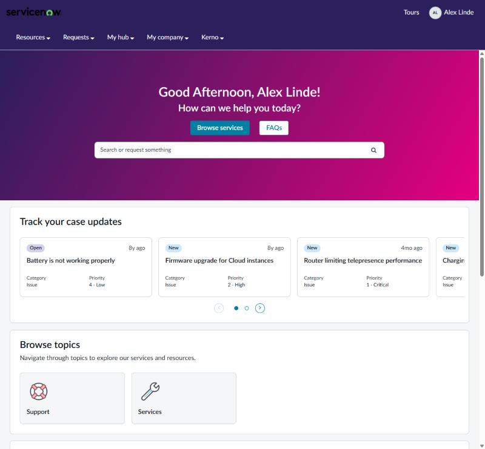
*`$ui-header-bg: #2B1F5C; $ui-header-text: #FFFFFF; $ui-hero-bg: linear-gradient(120deg, #2B1F5C, #E6007E); $ui-hero-text: #FFFFFF`*

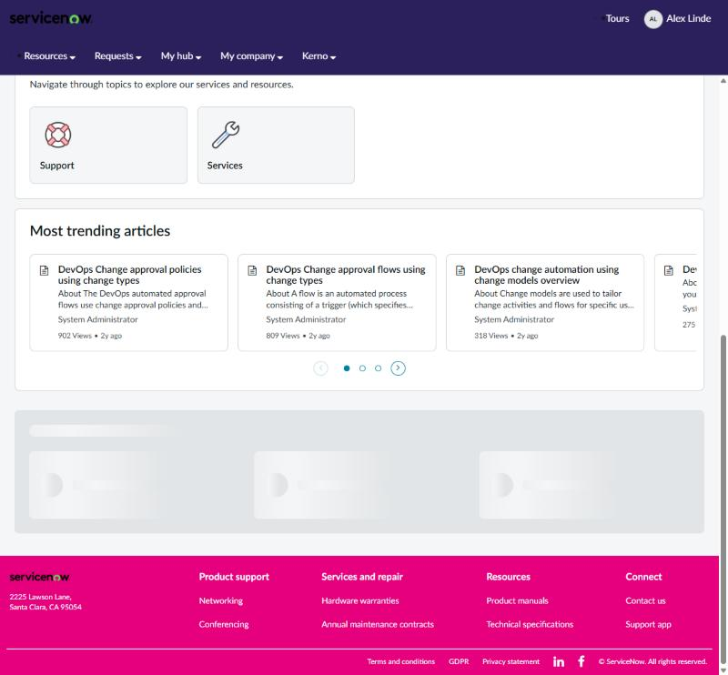
*`$ui-footer-bg: #E6007E; $ui-footer-text: #FFFFFF` - footer independent of the header*

*`$ui-subnav-bg: $noris-blue; $ui-subnav-text: #FFFFFF; $ui-subnav-hover-bg: $noris-blue-2` on a white header (noris example)*

| Token | Default | What it changes | Wired into |
|---|---|---|---|
| `$ui-header-bg` | `$palette-white` | Header (navbar) background. Footer and second menu row follow it unless set separately. | `$navbar-inverse-bg`, `$sp-navbar-inverse-bg`; feeds `$ui-header-hover-bg`, `$ui-header-active-bg`, `$ui-header-disabled-text`, `$ui-header-border` +2 |
| `$ui-header-text` | `$ui-text` | Header links, menu labels, user name, search icon. Hover/active/disabled shades are derived from it. | `$sp-tagline-color`, `$navbar-inverse-link-color`, `$navbar-inverse-link-hover-color`, `$navbar-inverse-link-active-color`, `$navbar-inverse-brand-color` +1 more; feeds `$ui-header-hover-bg`, `$ui-header-active-bg`, `$ui-header-disabled-text`, `$ui-footer-text`; overrides C1b, C3 |
| `$ui-header-text-muted` | `$ui-text-muted` | Secondary header text. | `$navbar-inverse-color` |
| `$ui-header-hover-bg` | `mix($ui-header-text, $ui-header-bg, 5%)` | Header menu item hover background (derived: 5% text over bg, works on dark headers). | `$navbar-default-link-hover-color`, `$navbar-inverse-link-hover-bg`; overrides C1b |
| `$ui-header-active-bg` | `mix($ui-header-text, $ui-header-bg, 10%)` | Header menu item active/open background (10% text over bg). | `$navbar-inverse-link-active-bg` |
| `$ui-header-disabled-text` | `mix($ui-header-text, $ui-header-bg, 20%)` | Disabled header items (20% text over bg). | `$navbar-inverse-link-disabled-color` |
| `$ui-header-border` | `$ui-header-bg` | Line under the header (same as bg = no line). | `$navbar-inverse-border` |
| `$ui-subnav-bg` | `$ui-header-bg` | Second header row (the menu bar) and its dropdown menus. Same as the header by default; set it with `$ui-subnav-text` for a light logo bar over a coloured menu bar. | `$sp-navbar-divider-color`, `$sp-nav-subnav`; feeds `$ui-subnav-hover-bg` |
| `$ui-subnav-text` | `null` | Menu bar text, carets and dropdown items when the menu bar has its own colour. `null` = header text (one-colour header). | overrides B |
| `$ui-subnav-hover-bg` | `darken($ui-subnav-bg, 8%)` | Hovered and open menu bar items and hovered dropdown items. Derived from `$ui-subnav-bg`; only used when `$ui-subnav-text` is set. | overrides B |
| `$ui-header-height` | `60px` | Header (navbar) height. | `$sp-navbar-height`, `$navbar-height` |
| `$ui-logo-max-height` | `40px` | Maximum logo height in the header. | `$sp-logo-max-height` |
| `$ui-logo-margin-x` | `6px` | Horizontal logo margin. | `$sp-logo-margin-x` |
| `$ui-logo-margin-y` | `6px` | Vertical logo margin. | `$sp-logo-margin-y` |
| `$ui-footer-bg` | `$ui-header-bg` | Footer background (defaults to the header background, like OOTB). | feeds `$ui-footer-divider`; overrides B |
| `$ui-footer-text` | `$ui-header-text` | Footer text and links. | feeds `$ui-footer-heading`, `$ui-footer-link-hover`, `$ui-footer-divider`; overrides B |
| `$ui-footer-heading` | `$ui-footer-text` | Footer column headings. | overrides B |
| `$ui-footer-link-hover` | `$ui-footer-text` | Footer link hover colour. | overrides B |
| `$ui-footer-divider` | `mix($ui-footer-text, $ui-footer-bg, 80%)` | Line above the footer's bottom bar. | overrides B |
| `$ui-hero-text` | `$ui-text` | Home banner and KB banner heading/subtitle colour. `null` = use the Portal Banner widget's colour options. | overrides B, C12 |
| `$ui-hero-bg` | `radial-gradient(ellipse 90% 120% at 30% -20%, rgba($palet...` | Home banner and KB banner background (any CSS background: colour, gradient, `url()`). `null` = use the widget's Background Image option. | overrides B, C12 |

## 2d. Buttons

| Token | Default | What it changes | Wired into |
|---|---|---|---|
| `$ui-button-primary-bg` | `$ui-primary` | Primary button background and border (incl. login button and editor primary button). Override to give CTAs a colour different from the brand primary. | `$btn-primary-bg`, `$btn-primary-border`, `$tox-primary-bg`, `$login-btn-bg`, `$login-btn-border`; overrides C1 |
| `$ui-button-primary-text` | `$ui-on-primary` | Primary button text. | `$btn-primary-color`; overrides C1 |
| `$ui-button-secondary-bg` | `$ui-surface` | Secondary (default) button background. | `$btn-default-bg` |
| `$ui-button-secondary-text` | `$ui-primary` | Secondary button text. | `$btn-default-color` |
| `$ui-button-secondary-border` | `$ui-border-strong` | Secondary button border. | `$btn-default-border`, `$border-tertiary-actionable` |
| `$ui-button-secondary-hover-border` | `$palette-neutral-70` | Secondary button hover border. | `$secondary-button-hover-border-color` |
| `$ui-button-secondary-active-border` | `$palette-neutral-85` | Secondary button pressed border. | `$secondary-button-active-border-color` |

## 2e. Typography

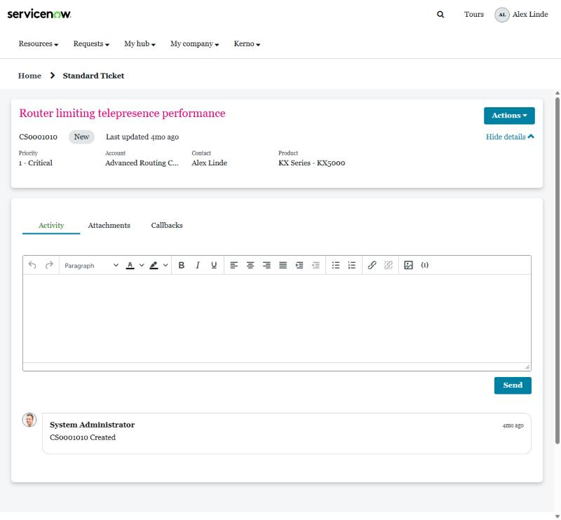
*`$ui-font-family: Georgia, serif; $ui-font-weight-heading: 700; $ui-heading-color: #E6007E`*

| Token | Default | What it changes | Wired into |
|---|---|---|---|
| `$ui-font-family` | `"Lato", sans-serif` | Font for everything: body, Bootstrap, Coral includes, `--now-font-family` and (after Sync) Next Experience components. The font must also be loaded, see Fonts. | `$font-family-sans-serif`, `$now-sp-font-family-sans-serif`; feeds `$ui-font-family-heading`; overrides A, C2 |
| `$ui-font-family-heading` | `$ui-font-family` | Font for h1-h6. | `$headings-font-family` |
| `$ui-font-size-base` | `16px` | Base text size; every Bootstrap font size (h1-h6, small, large) is computed from it. | `$font-size-base` |
| `$ui-font-weight-heading` | `600` | Heading weight. | `$headings-font-weight` |
| `$ui-heading-transform` | `null` | Letter case of page and widget titles (h1/h2), e.g. `uppercase`. `null` = as written. The hero sub-heading and Next Experience components keep their own case. | overrides B |
| `$ui-heading-letter-spacing` | `null` | Tracking for the same titles, e.g. `.04em` with uppercase. `null` = normal. | overrides B |
| `$ui-font-weight-strong` | `600` | Button and emphasised-label weight. | `$btn-font-weight` |
| `$ui-font-weight-medium` | `500` | Medium weight (small/meta text). | `$font-weight-small` |
| `$ui-line-height` | `1.4` | Body line height. | `$line-height-base` |
| `$ui-line-height-tight` | `1.1` | Heading and small-control line height. | `$headings-line-height`, `$line-height-small` |

## 2f. Shape & elevation

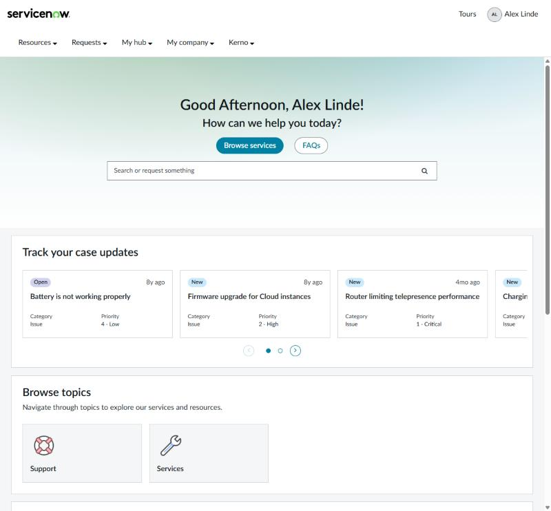
*All radii 0, `$ui-radius-button: 999px` (pill buttons), deeper `$ui-shadow-card`*

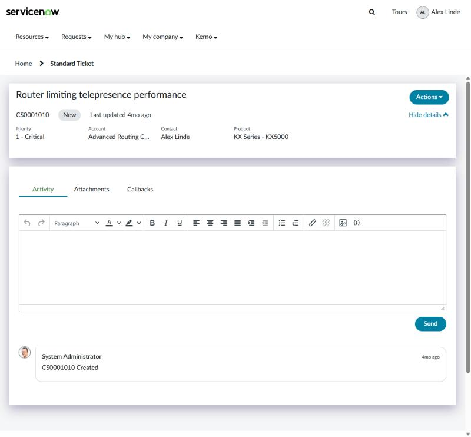
*Same overrides on a ticket page: square cards, pill buttons*

| Token | Default | What it changes | Wired into |
|---|---|---|---|
| `$ui-radius-sm` | `2px` | Small radius: small inputs, tags, Next Experience small radius. | `$border-radius-small`; feeds `$ui-radius-input-sm`; overrides A |
| `$ui-radius` | `4px` | Default radius: inputs, dropdowns, pills, ticket/approval/catalog/KB elements, Next Experience medium radius. | `$border-radius-base`, `$nav-pills-border-radius`; feeds `$ui-radius-button`, `$ui-radius-input`; overrides A, C2, C4, C5, C6, C7, C8, C9, C10, C12, C14 |
| `$ui-radius-md` | `6px` | Medium radius: ticket header cards, item panels, menus. | overrides C2, C6, C9 |
| `$ui-radius-lg` | `8px` | Large radius: cards, panels, modals, comment bubbles. | `$border-radius-large`; feeds `$ui-radius-input-lg`, `$ui-radius-card`; overrides A, C8, C14 |
| `$ui-radius-pill` | `999px` | Fully rounded chips, badges, pagers. | `$pager-border-radius`; overrides C6, C7, C8 |
| `$ui-radius-button` | `$ui-radius` | Button radius (also login, Next Experience buttons). 999px = pill buttons. | `$btn-border-radius-base`; feeds `$ui-radius-button-lg`, `$ui-radius-button-sm`; overrides A, C2, C9 |
| `$ui-radius-button-lg` | `$ui-radius-button` | Large button radius. | `$btn-border-radius-large`; overrides C2 |
| `$ui-radius-button-sm` | `$ui-radius-button` | Small button radius. | `$btn-border-radius-small`; overrides C2 |
| `$ui-radius-input` | `$ui-radius` | Input radius (login, MFA, editor). | `$input-border-radius`; overrides C9, C13 |
| `$ui-radius-input-sm` | `$ui-radius-sm` | Small input radius. | `$input-border-radius-small` |
| `$ui-radius-input-lg` | `$ui-radius-lg` | Large input radius. | `$input-border-radius-large` |
| `$ui-radius-card` | `$ui-radius-lg` | Panels/cards: KB tiles, ticket panels, catalog item panels, list widgets, datepicker. | `$panel-border-radius`; overrides A, C5, C6, C7, C10, C11 |
| `$ui-radius-search` | `9.6px` | Home banner, header and KB search boxes. | overrides C2 |
| `$ui-shadow-card` | `0 4px 8px 0 rgba(56, 56, 56, 0.25)` | Card / panel shadow (`$sp-panel-box-shadow`). | `$sp-panel-box-shadow`; overrides C5 |

## 2g. Spacing & layout

| Token | Default | What it changes | Wired into |
|---|---|---|---|
| `$ui-space-3xs` | `1px` | 1px spacing step (`$sp-space--3xs`). | `$sp-space--3xs` |
| `$ui-space-xxs` | `2px` | 2px step. | `$sp-space--xxs` |
| `$ui-space-xs` | `4px` | 4px step: small control padding, label margin, condensed table cells. | `$sp-space--xs`, `$padding-small-vertical`, `$padding-xs-vertical`, `$label-margin-bottom`, `$table-condensed-cell-padding` +1 more |
| `$ui-space-sm` | `8px` | 8px step: table cells, large control vertical padding, nav links, breadcrumbs. | `$sp-space--sm`, `$padding-large-vertical`, `$padding-xs-horizontal`, `$nav-link-padding`, `$table-cell-padding` +2 more |
| `$ui-space-md` | `12px` | 12px step: small control horizontal padding. | `$sp-space--md`, `$padding-small-horizontal` |
| `$ui-space-lg` | `16px` | 16px step: button horizontal padding, form-group spacing, alerts, modals. | `$sp-space--lg`, `$padding-base-horizontal`, `$form-group-margin-bottom`, `$nav-link-padding`, `$alert-padding` +3 more |
| `$ui-space-xl` | `24px` | 24px step: panel body/heading padding, large buttons. | `$sp-space--xl`, `$padding-large-horizontal`, `$panel-body-padding`, `$panel-heading-padding` |
| `$ui-space-xxl` | `32px` | 32px step. | `$sp-space--xxl` |
| `$ui-space-3xl` | `40px` | 40px step. | `$sp-space--3xl` |
| `$ui-page-padding` | `10px` | Padding around the page content (`$sp-page-padding-*`). | `$sp-page-padding-top`, `$sp-page-padding-bottom`, `$sp-page-padding-left`, `$sp-page-padding-right` |
| `$ui-grid-gutter` | `32px` | Bootstrap grid gutter (space between columns). | `$grid-gutter-width` |
