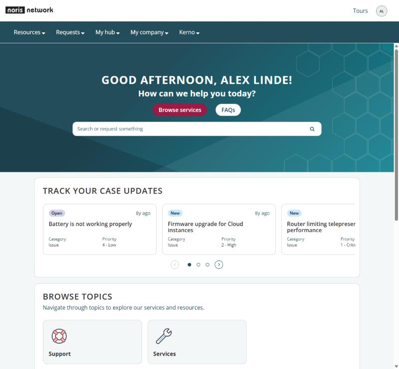
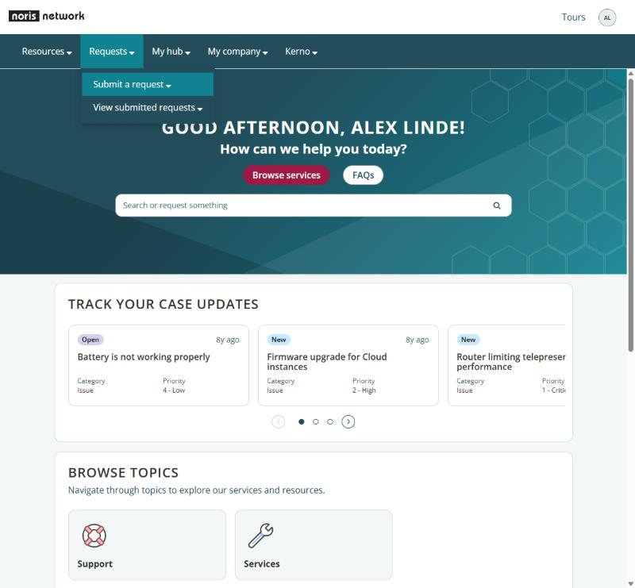

# noris network - example client theme

A second showcase of what one client's Section 1 can do. The brand was taken from noris.de (the site's stylesheets, October 2026), noris network's logo usage guideline (*Logo-Nutzungsrichtlinie*, from the noris.de download area) and their product sheets. noris's own ServiceNow customer portal already uses a light logo bar over a noris-blue menu bar, so this example builds on that.

## The brand, and where each part went

| noris brand | Where it is set |
|---|---|
| "noris blue" `#234D5B` for large fields, titles and the menu bar | `$palette-primary`, `$ui-heading-color`, `$ui-subnav-bg` |
| "noris blue 2" `#118291`, the interactive colour | `$palette-accent`, `$palette-focus`; links use it 15% darker (`$palette-secondary`) so they pass AA on the grey page too |
| Bordeaux `#9E1946` call-to-action pills | `$ui-button-primary-bg`, `$ui-radius-button: 999px` (hover darkens automatically) |
| Black logo on white, menu bar in noris blue with teal hover | `$ui-header-text`, `$ui-subnav-text: #FFFFFF`, `$ui-subnav-hover-bg` (new in v1.1) |
| noris.de promo gradient, the angled planes of their print covers, the hexagon motif | `$ui-hero-bg`: an SVG honeycomb as a data URI, two hard-stop planes, `linear-gradient(135deg, noris blue, noris blue 2)`; reaches the home and knowledge banners |
| Official 10% tints of noris blue | The whole neutral ramp: `mix($noris-blue, #FFFFFF, 10% … 90%)`; body text `#333` as on noris.de |
| Light blue `#BCD5DC`, teal washes `#E0EFF1` / `#F0F7F8`, light green `#D7FCD4`, grey blue `#3F8199` | Pinned light fills (1c) and status colours |
| Open Sans, titles in capitals with a little tracking | `$ui-font-family: "Open Sans", …`, `$ui-heading-transform: uppercase`, `$ui-heading-letter-spacing: .04em` (new in v1.1) |
| 12px cards with a soft shadow, 8px controls | `$ui-radius-lg: 12px`, `$ui-radius: 8px`, `$ui-shadow-card: 0 4px 15px rgba($noris-blue, .12)` |
| Deep noris blue footer with the white logo | `$ui-footer-bg: mix(#000000, $noris-blue, 30%)`, `$ui-footer-text`, `$ui-footer-link-hover` |

Contrast checked (WCAG): links 5.5:1 on the page background, muted text 6.5:1, input borders 3.2:1 on white, white on bordeaux 7.8:1, white on teal 4.5:1, focus ring 4.5:1. Danger is a brighter red (`#C4122F`) so errors never look like a call to action.

## Files

| File | What it is |
|---|---|
| `css_variables.noris.scss` | The theme's complete CSS Variables. Only Section 1 differs from `theme/css_variables.template.scss`. |
| `noris-fonts.scss` | sp_css with Open Sans embedded as one base64 variable WOFF2 (latin, weights 300-800), made with `tools/embed_font.py "Open Sans" "300 800=fonts/open-sans-latin-var.woff2"`. CSS include, order 95. |
| `fonts/open-sans-latin-var.woff2` | Open Sans, Copyright 2020 The Open Sans Project Authors, SIL Open Font License 1.1 (`fonts/OFL.txt`). Same file Google Fonts serves. |
| `hero-hexagons.py`, `hero-hexagons.svg` | Draws the hexagon motif for the banner and prints the data URI that `$noris-hexagons` holds. Edit and rerun to change the pattern. |
| `noris-network-logo-black.svg` | Official black logo from the noris.de download area, header logo on the lab portal. |
| `noris-network-logo-white.svg` | Official white logo with its viewBox trimmed to the mark (the download has wide built-in margins), footer logo. The footer slot is 100px wide, which is noris's minimum digital logo width. |

The logos are trademarks of noris network AG. noris's guideline allows their use for presentations and official purposes connected with noris network AG; keep them to demos.

## Beyond Section 1

- **Font include** `noris-fonts` on the theme (order 95).
- **Logo** on the portal record (`sp_portal.logo`): the black SVG.
- **Footer** in the portal record's footer settings (`quick_start_config` > `footer`): `logo_img_name: "/<white logo attachment sys_id>.iix"`, `org_info: ["noris network AG", "Thomas-Mann-Straße 16 – 20", "90471 Nürnberg"]`, `copyright`. The white logo must be an image attachment (table `ZZ_YYsp_portal`), or customers get a 403 and a broken image.
- **Sync Next Experience theme** once, so the Product Catalog and other Next Experience components pick up Open Sans and the noris colours. Titles inside those components keep their own case.

## On the kev instance

| Record | sys_id |
|---|---|
| sp_theme *noris network Theme (example)* | `d71405382beacf54a5feffb86e91bf75` |
| sp_css / include *noris-fonts* | `057339742b7fcf10a5feffb86e91bfb1` / `0d7339742b7fcf10a5feffb86e91bfb2` |
| Generated UX theme | `1dd33db42b7fcf10a5feffb86e91bf09` |
| Logo attachments (black / white) | `f8b3b5b42b7fcf10a5feffb86e91bf2b` / `96053d382b3b4350ff68f76a6e91bfe2` |
| Update set *Portal Brand Tokens - noris network example* | `69d2f5f02b7fcf10a5feffb86e91bf30` (30 entries; needs the Framework set at v1.1) |
| Live on | lab portal `/theme_lab` (`5db5c93c2b7f0350ff68f76a6e91bff6`) |

The theme record is the one the earlier noris test theme used, rebuilt from scratch: new name, new CSS Variables, new font include and a freshly generated UX theme. The old generated UX theme was deleted.

To show Aareal on the lab portal again, see [the Aareal example](../aareal/README.md#on-the-kev-instance).

## What the example added to the framework (v1.1)

Both additions are `null` by default, so other themes don't change.

1. **Two-tone header.** The header widget paints the menu bar with `$ui-subnav-bg` but kept the header text colour, so a coloured menu bar under a white header was unreadable. `$ui-subnav-text` and `$ui-subnav-hover-bg` now colour the menu bar's items, carets, dropdowns, hover state, focus outline and loading dots.
2. **Heading case.** `$ui-heading-transform` and `$ui-heading-letter-spacing` set page and widget titles (h1/h2) in capitals; the hero sub-heading stays as written.

Along the way `tools/embed_font.py` learned weight ranges for variable fonts and now always writes LF line endings.
